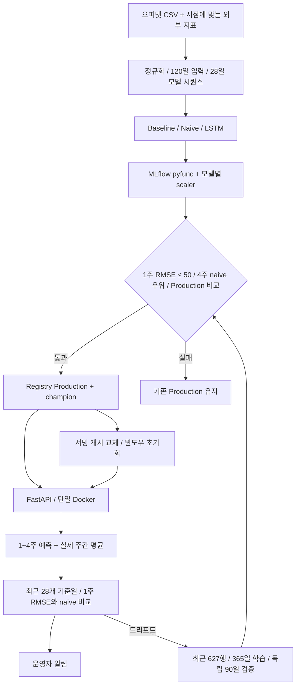

# 역할별 작업 및 통합 순서

GitHub 이슈의 담당자별 체크리스트를 기준으로 진행합니다.

1. **yunanana**: 출처/단위/시차, 정규화 CSV, 추가 피처와 정책 변수 정의, 누수·결측·휴일 정책.
2. **bookschooler**: baseline/naive/LSTM 검증, MLflow 기록, 게이트, 고정 scaler, 최근 627행·365일 학습·90일 독립 검증 fine-tuning.
3. **hootbee**: MLflow 로더, 실제 버전 응답, batch 라우터, Docker, Lazy/Eager, 캐시 교체.
4. **kchanis1223**: RMSE, 실제값 연결/윈도우, 정상·급변 시나리오, 로그·운영자 알림·재학습·중복 방지.
5. **Hwiing**: 계약 변경 조정, 병합, end-to-end 시연, README/API/아키텍처·발표·증빙 통합.

데이터 계약 → baseline 산출물 → MLflow/서빙 → 배치/드리프트 → fine-tuning/승격 → 재예측 순서로 통합합니다.
데이터 확정 전에도 각 담당은 합성 fixture로 개발할 수 있습니다. 공통 파일 변경은 PR에서 관련 담당자를 지정합니다.

## 공동 완료 기준

- CSV 업로드 → baseline → 정상 예측 200 / 잘못된 입력 422.
- Lazy/Eager 시작·첫 요청·후속 요청 측정표.
- gate pass/fail 모두 재현, 동일 검증 구간의 naive 비교와 MLflow 기록.
- 컨테이너에서 동일 API 동작, 로그와 모델 상태 재현.
- 국제유가·환율·유류세·공급 차질 시나리오 → RMSE → 경고 로그·운영자 알림 → 재학습 → 게이트 재검증.
- 성공 시 실제 버전 변경, 실패 시 기존 버전·예측 유지, 중복 트리거 방지.

## 발표·기획서 6항목

1. 운송·물류회사 유류비 계획의 Pain Point와 이해관계자 가치.
2. 1~4주 경유 평균가 예측 솔루션, 품질·응답 시간 운영 목표.
3. 배포 게이트·모니터링·드리프트 대응 정책 및 근거.
4. 위 아키텍처와 실제 구현 대응.
5. Swagger 기반 API 명세와 요청/응답·오류 예시.
6. 컨테이너·게이트·버전 전환·드리프트/재학습 로그의 실제 화면과 시연.

증빙은 실행 환경·명령·측정값과 함께 기록합니다. 구현 예정 항목에 성공 화면이나 성능 수치를 미리 채우지 않습니다.
